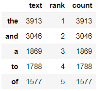
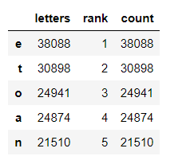
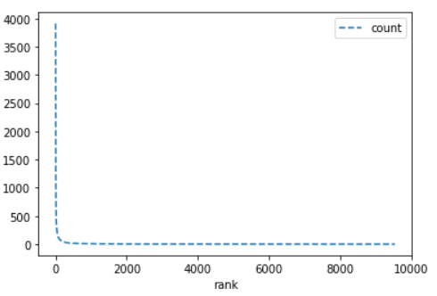
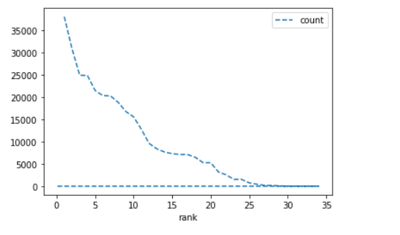
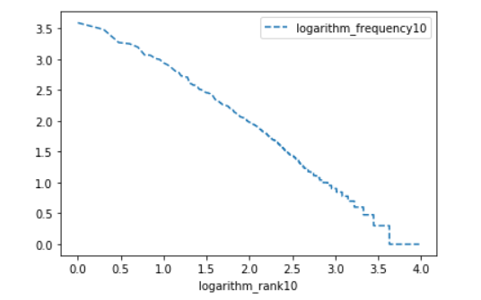
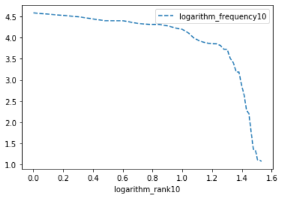
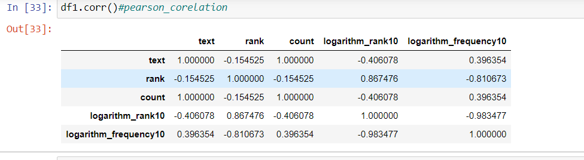
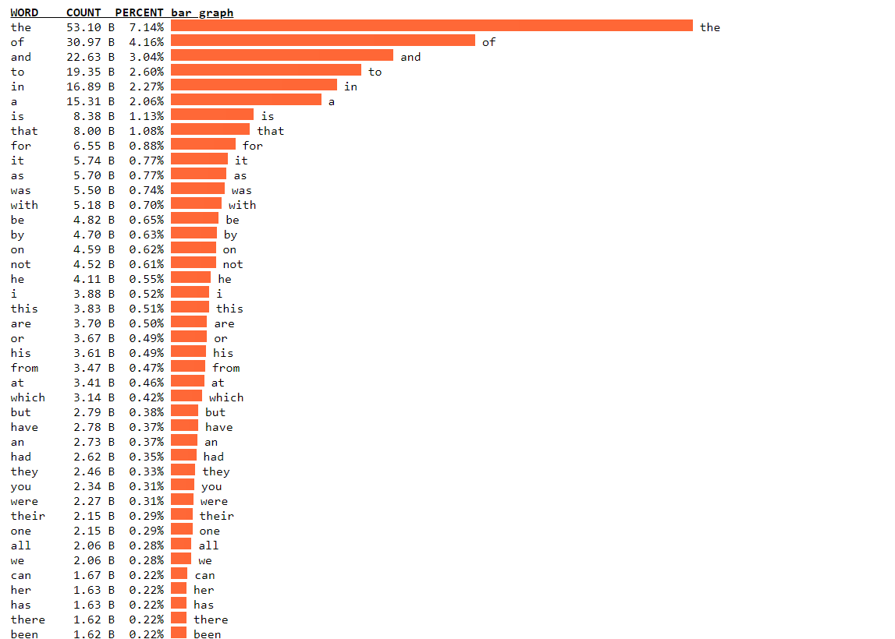
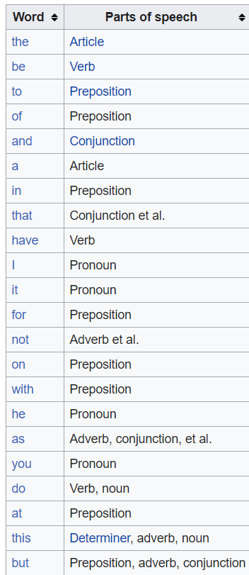
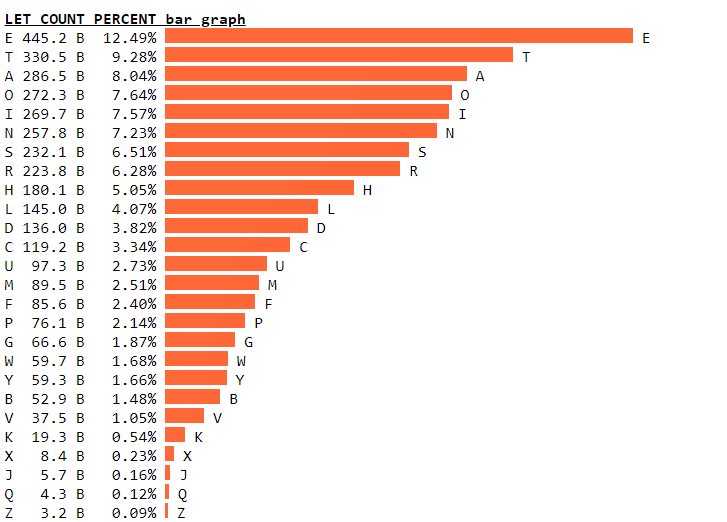

# Zipf’s Law Assignment (DSE 308)

Aman Kumar 17025

Applying Lingusitic techniques in Mark Twain’s novel “The Adventures of Tom Sawyer” from Project Gutenberg

## Part A
**First calculate the token-type ratio of the above text**

**token-type ratio** = 7.7343668168010895

## Part B

* **Calculate the frequency of occurrence of each item. Rank them in descending order of frequency**

 

* **Write down the five most frequent items and comment on them.**

**Five frequent words** the ,and ,a ,to ,of

**Five frequent words** e, t, o , a, n

**Most common words** are mainly Artice , Verb , Preposition and Nouns

**Most common letters** are mainly vowels (a,e,i,o,u)

* **Plot a graph with Rank on the X-axis and Frequency on the Y-axis**

 

* **Plot a graph with log10(Rank) on the X-axis and log10(Frequency) on Y-axis.**

* **What is the Pearson's coefficient of correlation between rank and frequency?**

**Pearson’s correlation coefficient** is the test statistics that measures the statistical relationship, or association, between two continuous variables.  It is known as the best method of measuring the association between variables of interest because it is based on the method of covariance.  It gives information about the magnitude of the association, or correlation, as well as the direction of the relationship.

here two variables are words(letters) and rank.

 

## Part C

**) Write a short note on Zipf's law and discuss any patterns which emerged from the above data
by using your best judgment and going beyond the numerical results. For example, since you
have studied both words and letters, are there any interesting similarities (or differences)
which you observe? Comments should be along these lines.**

**Zipf’s law** says that: It is relationship between the frequency of a word f and rank its position in the list, known as its rank r
 
**f ∝ 1/r**

**Most common words** are mainly Artice , Verb , Preposition and Nouns

**Most common letters** are mainly vowels (a,e,i,o,u)
 
**NOTE**  Most common words and frequency can be used in Cryptanalysis.

 
