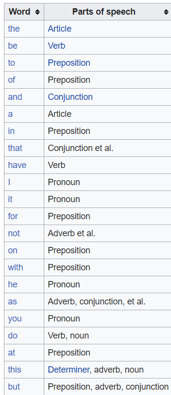

# Zipf’s Law Assignment (DSE 308)

Aman Kumar 17025

Applying Lingusitic techniques in Mark Twain’s novel “The Adventures of Tom Sawyer” from Project Gutenberg

## Part A

token-type ratio = 10.018034265103697

## Part B

* 

*

*

*

* **Pearson’s correlation coefficient** is the test statistics that measures the statistical relationship, or association, between two continuous variables.  It is known as the best method of measuring the association between variables of interest because it is based on the method of covariance.  It gives information about the magnitude of the association, or correlation, as well as the direction of the relationship.

here two variables are words(letters) and rank.

## Part C

**Zipf’s law** says that: It is relationship between the frequency of a word f and rank its position in the list, known as its rank r

**f ∝ 1/r**

**Most common words** are mainly Artice , Verb , Preposition and Nouns

**Most common letters** are mainly vowels (a,e,i,o,u)
 
**NOTE**  Most common words and frequency can be used in Cryptanalysis.

